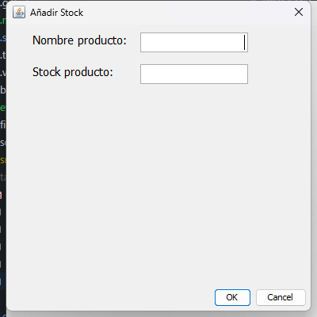
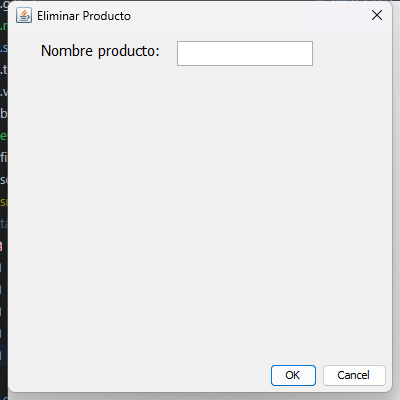

# Practica 5 RA5 - Gestion de Tienda con MongoDB

Aplicacion Java Swing para gestionar una tienda con persistencia en MongoDB. En esta entrega se ha refactorizado la carga de inventario, la exportacion historica, el mantenimiento del inventario y el login para que todo funcione contra colecciones MongoDB.

## Resumen rapido

- DAO principal: `DaoImplMongoDB`
- Base de datos: `shop`
- Colecciones usadas: `inventory`, `historical_inventory`, `users`
- Interfaz: `LoginView`, `ShopView`, `ProductView`, `CashView`
- Evidencias adicionales: [`evidence/EVIDENCIAS.md`](evidence/EVIDENCIAS.md)

## Ejecucion

### Ejecutar la aplicacion

1. Abrir el proyecto Maven en Eclipse.
2. Ejecutar la clase `view.LoginView`.
3. Acceder con uno de estos usuarios de prueba:

- usuario `1`, password `1234`
- usuario `123`, password `test`

Si no hay un MongoDB local levantado, la aplicacion puede arrancar un MongoDB embebido y sembrar los datos base automaticamente.

### Ejecutar tests

El proyecto incluye Maven Wrapper, asi que no hace falta tener Maven instalado globalmente.

```powershell
.\mvnw.cmd test
```

Resultado real verificado: `8 tests ejecutados, 0 fallos, 0 errores`.

## Documento funcional

### 1. Carga inicial del inventario desde MongoDB

Se ha implementado haciendo que `Shop.initializeInventory()` delegue en `DaoImplMongoDB#getInventory()`, que lee la coleccion `inventory` de la base `shop` y construye la lista de productos en memoria al abrir la aplicacion.

Comprobante visual: la aplicacion arranca correctamente y entra al menu principal despues del login.


Comprobante de datos: ejemplo real del inventario cargado desde MongoDB.

Archivo completo: [`evidence/dumps/inventory.json`](evidence/dumps/inventory.json)

```json
{
  "id": 1,
  "name": "Manzana",
  "available": true,
  "stock": 50
}
```

### 2. Exportar inventario a `historical_inventory`

Se ha hecho desde `ShopView.exportInventory()`, que llama a `DaoImplMongoDB.writeInventory()` para guardar una foto completa del inventario actual en la coleccion `historical_inventory`, anadiendo tambien el campo `created_at`.

Comprobante visual: mensaje real mostrado por la aplicacion al exportar correctamente.


Comprobante de datos: ejemplo real del snapshot insertado en `historical_inventory`.

Archivo completo: [`evidence/dumps/historical_inventory.json`](evidence/dumps/historical_inventory.json)

```json
{
  "id": 1,
  "name": "Manzana",
  "stock": 50,
  "created_at": {
    "$date": "2026-03-09T16:51:42.213Z"
  }
}
```

### 3. Mantenimiento del inventario en MongoDB

Se ha implementado conectando las opciones `2. Anadir producto`, `3. Anadir stock` y `9. Eliminar producto` con los metodos `addProduct`, `updateProduct` y `deleteProduct` del DAO MongoDB. Cada accion modifica la interfaz y tambien deja la coleccion `inventory` sincronizada.

#### 3.1 Anadir producto

Se abre `ProductView`, se introduce el nuevo producto y al confirmar se inserta un documento nuevo en `inventory`.


Comprobante de datos tras la insercion:

Archivo completo: [`evidence/dumps/inventory_after_add.json`](evidence/dumps/inventory_after_add.json)

```json
{
  "id": 6,
  "name": "testmongo",
  "available": true,
  "stock": 7
}
```

#### 3.2 Anadir stock

Se reutiliza `ProductView` en modo stock. La aplicacion busca el producto, suma el stock introducido y actualiza el documento existente en MongoDB.




Comprobante de datos tras actualizar stock:

Archivo completo: [`evidence/dumps/inventory_after_stock.json`](evidence/dumps/inventory_after_stock.json)

```json
{
  "id": 6,
  "name": "testmongo",
  "available": true,
  "stock": 12
}
```

#### 3.3 Eliminar producto

Se vuelve a usar `ProductView` en modo eliminar. La aplicacion localiza el producto por nombre y borra su documento de `inventory`.




Comprobante de datos tras eliminarlo:

Archivo completo: [`evidence/dumps/inventory_after_delete.json`](evidence/dumps/inventory_after_delete.json)

```json
[
  "testmongo ya no aparece en la coleccion"
]
```

### 4. Login usando MongoDB

El login se ha refactorizado para que `Employee.login()` consulte la coleccion `users` en lugar de usar MySQL. Si las credenciales son correctas se abre `ShopView`; si no, se muestra un mensaje de error.

Comprobante visual del login correcto:


Comprobante visual del login incorrecto:


Comprobante de datos: usuarios reales usados para validar credenciales.

Archivo completo: [`evidence/dumps/users.json`](evidence/dumps/users.json)

```json
{
  "employeeId": 1,
  "name": "Admin",
  "password": "1234"
}
```

```json
{
  "employeeId": 123,
  "name": "Test",
  "password": "test"
}
```

## Test, pruebas y evidencias

### Pruebas manuales realizadas

Se ha abierto el proyecto en Eclipse, se ha ejecutado la aplicacion real en el equipo local y se han capturado las pantallas de comprobacion del flujo completo.

Comprobante del proyecto abierto en Eclipse:


Pruebas manuales cubiertas:

- login correcto
- login incorrecto
- acceso al menu principal
- exportacion de inventario
- insercion de producto
- actualizacion de stock
- eliminacion de producto
- verificacion de los datos escritos en MongoDB

### Tests automatizados de regresion

Ademas de la comprobacion manual, se han dejado tests automaticos para validar los puntos del enunciado sin depender de una revision visual.

Cobertura automatizada:

1. Carga inicial desde `inventory`
2. Exportacion a `historical_inventory`
3. Insercion, actualizacion y borrado en `inventory`
4. Mensaje informativo cuando la exportacion va bien
5. Mensaje de error cuando la exportacion falla
6. Login correcto abre el menu principal
7. Login incorrecto muestra error
8. Fallback a MongoDB embebido cuando no hay servidor externo

Clases de test:

- [`src/test/java/dao/DaoImplMongoDBIntegrationTest.java`](src/test/java/dao/DaoImplMongoDBIntegrationTest.java)
- [`src/test/java/dao/EmbeddedMongoFallbackTest.java`](src/test/java/dao/EmbeddedMongoFallbackTest.java)
- [`src/test/java/view/ViewBehaviorTest.java`](src/test/java/view/ViewBehaviorTest.java)

Comando ejecutado:

```powershell
.\mvnw.cmd test
```

Resultado real obtenido:

```text
Test set: dao.EmbeddedMongoFallbackTest
Tests run: 1, Failures: 0, Errors: 0, Skipped: 0

Test set: dao.DaoImplMongoDBIntegrationTest
Tests run: 3, Failures: 0, Errors: 0, Skipped: 0

Test set: view.ViewBehaviorTest
Tests run: 4, Failures: 0, Errors: 0, Skipped: 0
```

Reportes generados:

- [`target/surefire-reports/dao.DaoImplMongoDBIntegrationTest.txt`](target/surefire-reports/dao.DaoImplMongoDBIntegrationTest.txt)
- [`target/surefire-reports/dao.EmbeddedMongoFallbackTest.txt`](target/surefire-reports/dao.EmbeddedMongoFallbackTest.txt)
- [`target/surefire-reports/view.ViewBehaviorTest.txt`](target/surefire-reports/view.ViewBehaviorTest.txt)

## Documento tecnico

### 1. Dependencias anadidas

Se ha anadido el driver oficial de MongoDB para la persistencia real y soporte de testing con JUnit 5 y MongoDB embebido para la regresion.

```xml
<dependency>
  <groupId>org.mongodb</groupId>
  <artifactId>mongodb-driver-sync</artifactId>
  <version>5.4.0</version>
</dependency>
```

Comprobante tecnico general: el proyecto queda visible en Eclipse con la nueva estructura y dependencias integradas.


### 2. Nueva clase `DaoImplMongoDB`

Se ha creado [`src/dao/DaoImplMongoDB.java`](src/dao/DaoImplMongoDB.java) en el paquete `dao` implementando la interfaz `Dao` y resolviendo la logica MongoDB de `connect`, `getInventory`, `writeInventory`, `getEmployee`, `addProduct`, `updateProduct` y `deleteProduct`.

### 3. Nueva utilidad `MongoSupport`

Se ha creado [`src/utils/MongoSupport.java`](src/utils/MongoSupport.java) para centralizar la conexion, el nombre de la base de datos, las colecciones, el auto-seeding de `inventory` y `users`, y la configuracion de arranque.

### 4. Nuevo fallback `EmbeddedMongoServer`

Se ha creado [`src/utils/EmbeddedMongoServer.java`](src/utils/EmbeddedMongoServer.java) para poder levantar un MongoDB embebido cuando el sistema no tiene uno disponible y asi mantener la aplicacion y los tests operativos.

### 5. Cambio en `DaoFactory`

Se ha actualizado [`src/dao/DaoFactory.java`](src/dao/DaoFactory.java) para que el DAO por defecto sea `mongo`, manteniendo `jdbc`, `hibernate` y `file` como alternativas.

### 6. Cambio en `Shop`

Se ha actualizado [`src/main/Shop.java`](src/main/Shop.java) para que la inicializacion del inventario y las operaciones de mantenimiento trabajen con el DAO configurado, que ahora por defecto es MongoDB.

### 7. Cambio en `Employee`

Se ha actualizado [`src/model/Employee.java`](src/model/Employee.java) para que la autenticacion del empleado consulte el DAO MongoDB y valide contra la coleccion `users`.

### 8. Cambios en las vistas para poder probar la interfaz

Se han ajustado [`src/view/LoginView.java`](src/view/LoginView.java) y [`src/view/ShopView.java`](src/view/ShopView.java) para que los mensajes y aperturas de ventana se puedan verificar tambien por test sin romper el comportamiento real de la aplicacion.

## Datos iniciales

Si la base esta vacia, la aplicacion crea automaticamente estos datos:

- usuarios: `1 / 1234` y `123 / test`
- inventario: `Manzana`, `Pera`, `Hamburguesa`, `Fresa`, `Leche`

Esto permite arrancar la practica sin preparar la base a mano.

## Configuracion disponible

- `shop.dao` -> por defecto `mongo`
- `shop.mongo.connectionString` -> por defecto `mongodb://localhost:27017`
- `shop.mongo.database` -> por defecto `shop`
- `shop.mongo.autoSeed` -> por defecto `true`
- `shop.mongo.embedded` -> por defecto `true`

## Archivos de apoyo

- Documento adicional de evidencias: [`evidence/EVIDENCIAS.md`](evidence/EVIDENCIAS.md)
- Dumps de MongoDB: [`evidence/dumps`](evidence/dumps)
- Capturas: [`evidence/screenshots`](evidence/screenshots)
- Script para consultar Mongo: [`evidence/scripts/QueryMongo.java`](evidence/scripts/QueryMongo.java)
- Script para repetir snapshots de mantenimiento: [`evidence/scripts/collect-maintenance-snapshots.ps1`](evidence/scripts/collect-maintenance-snapshots.ps1)
