# MP0486 RA1 - Refactor Login usando ObjectDB

Este README se ha rehcho desde cero con capturas nuevas y comprobacion funcional real de frontend y backend, incluyendo lo que el sistema puede y no puede hacer.

## Documento funcional

### 1. Refactor login usando ObjectDB

Las credenciales se validan en ObjectDB en `objects/users.odb` (tabla `users`) mediante `DaoImplObjectDB`.

Archivos implicados:

- `src/dao/DaoImplObjectDB.java`
- `src/utils/ObjectDbSupport.java`
- `src/model/Employee.java`
- `src/dao/DaoFactory.java`

### Comprobacion funcional de la app (capturas nuevas)

#### Login

- Login incorrecto con datos reales (`666` / `nose`):
  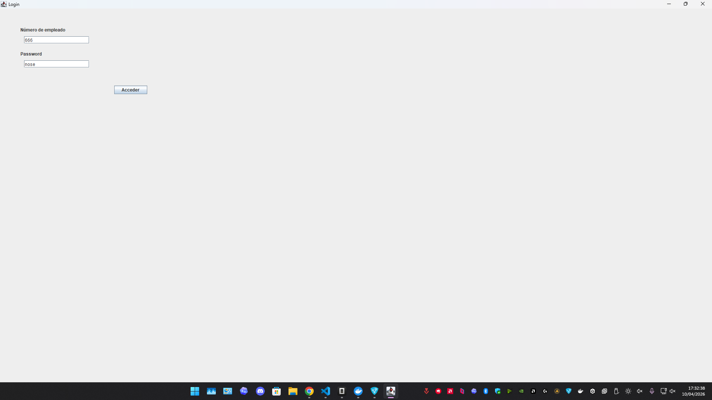
- Mensaje de error en login incorrecto:
  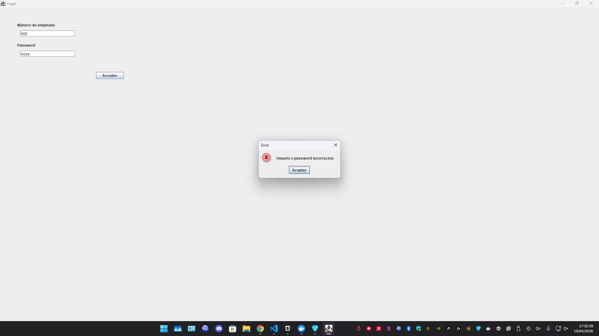
- Login correcto con datos reales (`123` / `test`):
  
- Acceso al menu principal:
  

#### Mantenimiento (que puede hacer)

- Exportar inventario:
  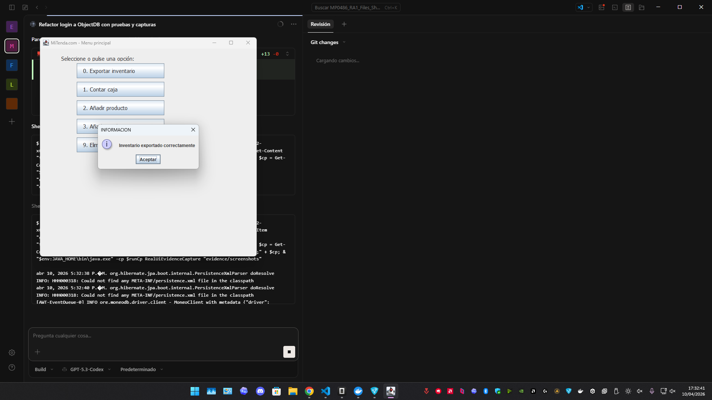
- Anadir producto con stock visible (`7`):
  
- Confirmacion producto anadido:
  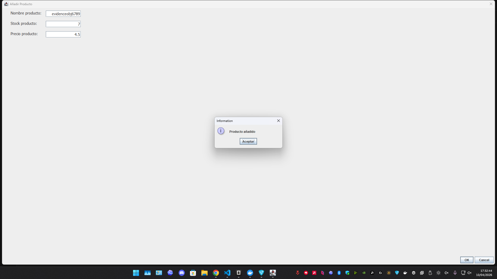
- Anadir stock con cantidad visible (`5`):
  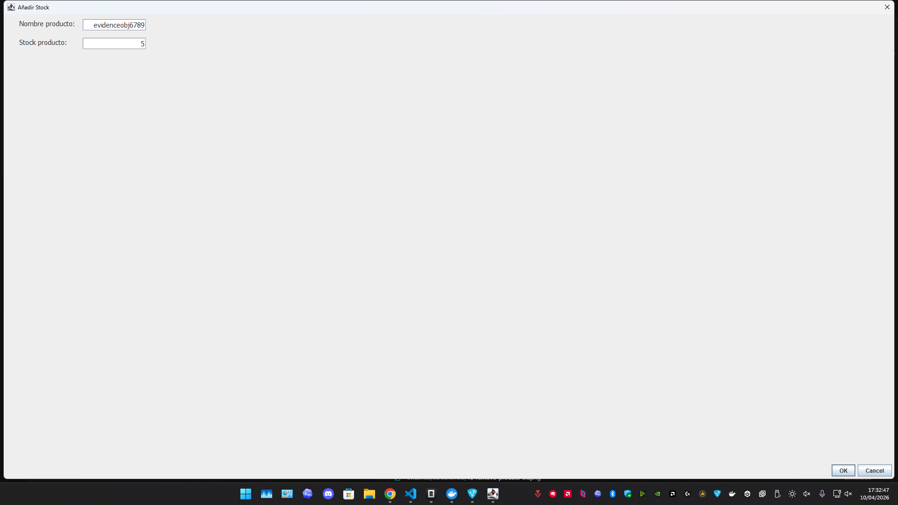
- Confirmacion stock actualizado:
  
- Eliminar producto:
  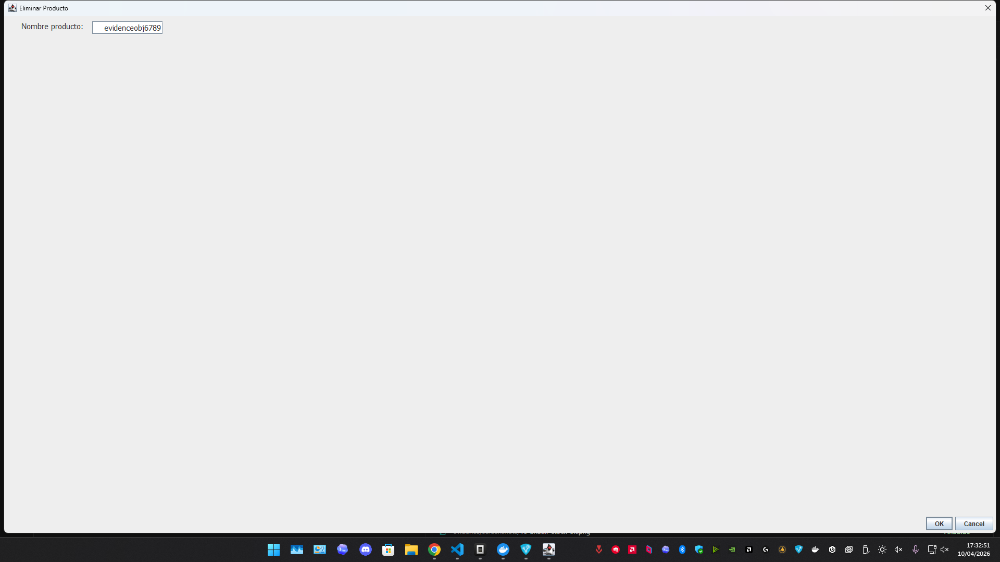
- Confirmacion producto eliminado:
  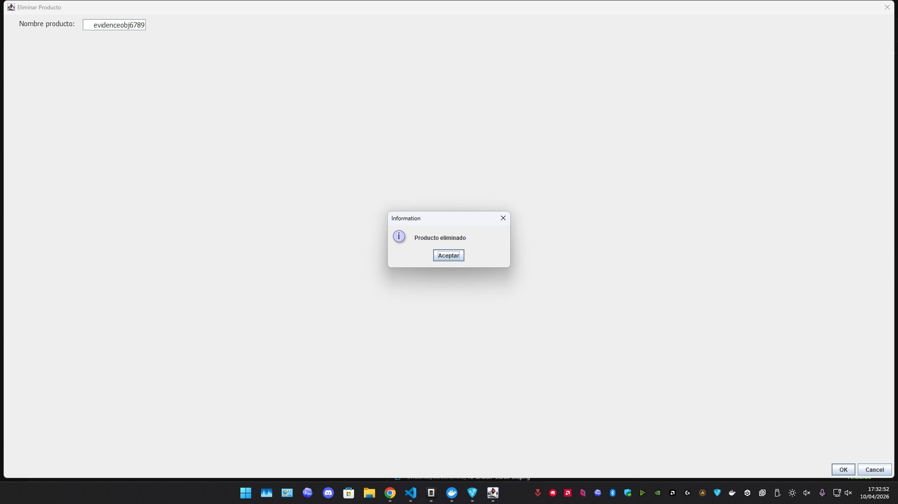

#### Mantenimiento (que NO puede hacer)

- No permite anadir producto duplicado:
  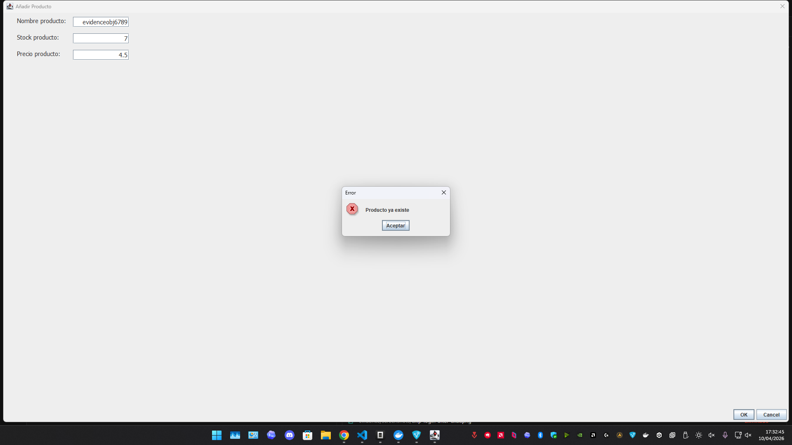
- No permite anadir stock a un producto inexistente:
  
- No permite eliminar un producto inexistente:
  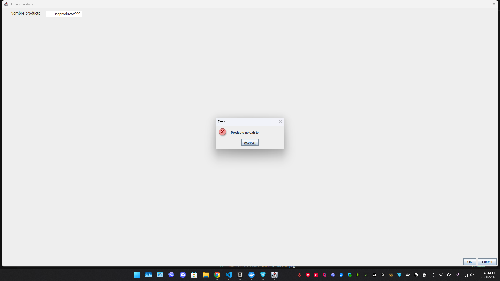

### Comprobacion backend real (can / cannot)

Se ejecuta una verificacion real contra ObjectDB y MongoDB con resultado consolidado:

- `LOGIN_OK_CAN=true`
- `LOGIN_BAD_CANNOT=true`
- `ADD_PRODUCT_CAN=true`
- `ADD_STOCK_CAN=true`
- `DELETE_MISSING_CANNOT=true`
- `DELETE_PRODUCT_CAN=true`

Archivo de salida real:

- `evidence/dumps/backend_verification.txt`

Captura de backend:

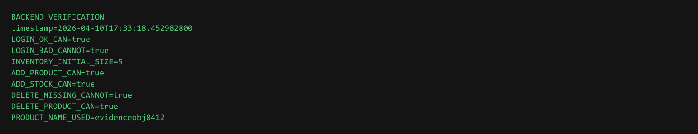

## Evidencias de base de datos

### ObjectDB

- Dump real de usuarios en ObjectDB: `evidence/dumps/users_objectdb.json`
- Captura del contenido de usuarios ObjectDB:
  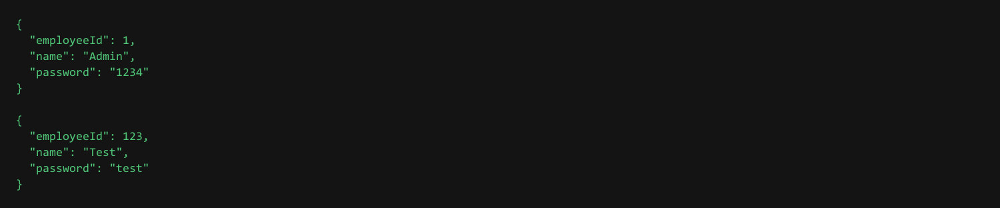

### MongoDB

- Dump real de usuarios en MongoDB: `evidence/dumps/users.json`
- Captura del contenido de usuarios MongoDB:
  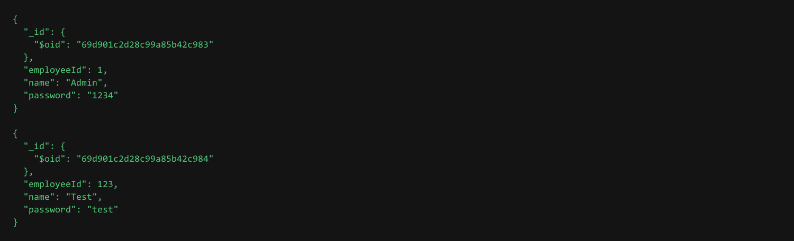
- Dump real de inventario tras comprobaciones backend: `evidence/dumps/inventory_backend.json`
- Captura del inventario backend:
  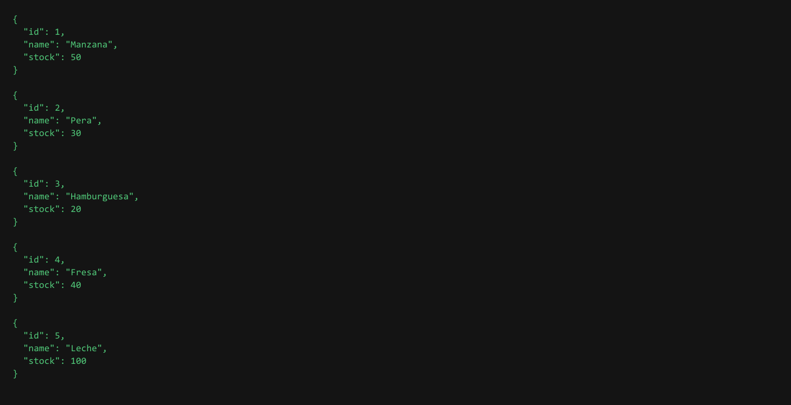

## Test unitario (Regresion)

Se mantiene la clase de regresion pedida para login:

- `src/test/java/view/LoginObjectDbRegressionTest.java`

Casos:

1. Verificar login correcto accede al menu principal
2. Verificar login incorrecto muestra mensaje de error

Comando:

```powershell
.\mvnw.cmd -Dtest=view.LoginObjectDbRegressionTest test
```

## Documento tecnico

### 1. Instalar dependencias ObjectDB

En `pom.xml`:

```xml
<repositories>
  <repository>
    <id>objectdb</id>
    <name>ObjectDB Repository</name>
    <url>https://m2.objectdb.com</url>
  </repository>
</repositories>
```

```xml
<dependency>
  <groupId>com.objectdb</groupId>
  <artifactId>objectdb</artifactId>
  <version>2.9.2</version>
</dependency>
```

### 2. Crear carpeta `objects` a nivel de proyecto

Carpeta creada en raiz con `objects/users.odb`.

### 3. Nueva clase `DaoImplObjectDB`

Cumplido en `src/dao/DaoImplObjectDB.java`:

- creada en package `dao`
- implementa interfaz `Dao`
- implementa logica de `getEmployee`

### 4. Modificar clase `Employee`

Cumplido en `src/model/Employee.java`:

- `@Entity`
- `@Transient` en `dao`
- tipo de `employee.dao` -> `DaoImplObjectDB`
- tabla `users` con `@Table(name = "users")`
