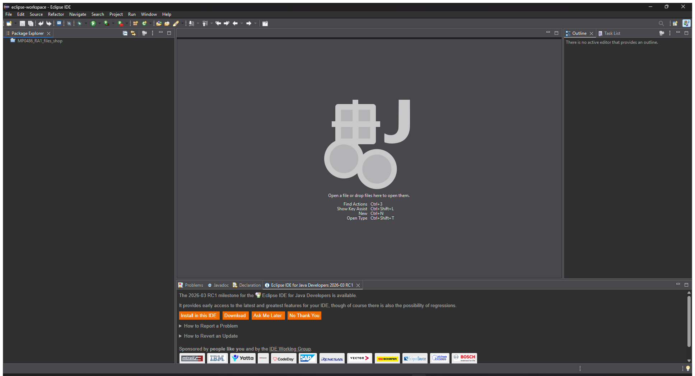
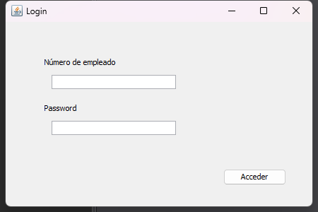
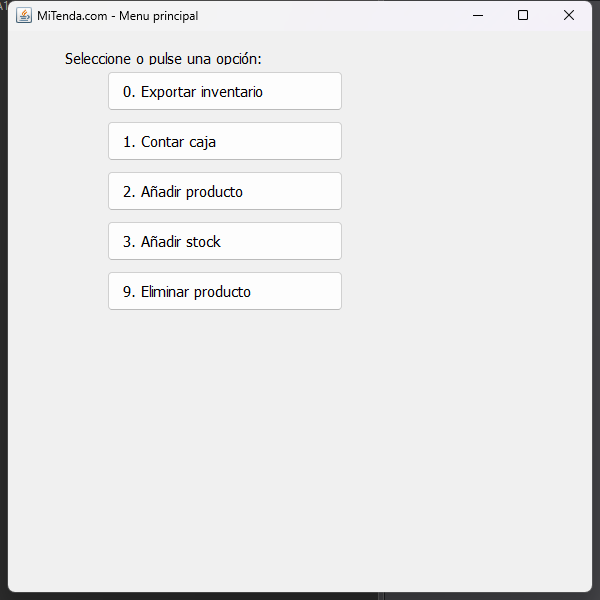
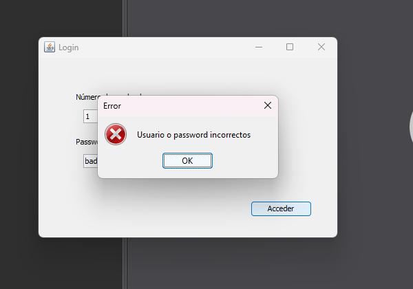
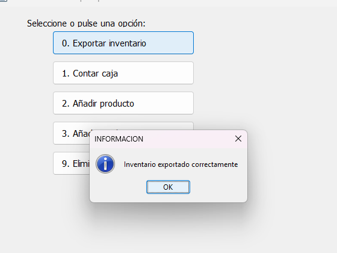
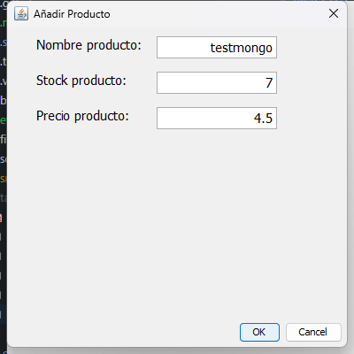
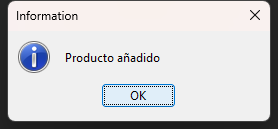
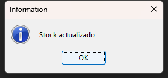
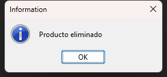

# Evidencias de ejecucion

Documento de apoyo con capturas reales tomadas en el equipo local el `2026-03-09`.

## 1. Entorno arrancado

Resumen: proyecto abierto en Eclipse y aplicacion Swing ejecutada en local.

### Eclipse con el proyecto cargado



### Pantalla de login



### Login correcto y acceso al menu



### Login incorrecto y mensaje de error



## 2. Exportacion a MongoDB

Resumen: la opcion `0. Exportar inventario` inserta el inventario actual en `historical_inventory`.

### Confirmacion visual de exportacion



### Snapshot generado en `historical_inventory`

Archivo completo: [`historical_inventory.json`](dumps/historical_inventory.json)

```json
{
  "id": 1,
  "name": "Manzana",
  "stock": 50,
  "created_at": {
    "$date": "2026-03-09T16:51:42.213Z"
  }
}
```

## 3. Carga inicial y login contra MongoDB

Resumen: la aplicacion carga `inventory` al iniciar y valida usuarios desde `users`.

### Coleccion `users`

Archivo completo: [`users.json`](dumps/users.json)

```json
{
  "employeeId": 1,
  "name": "Admin",
  "password": "1234"
}
```

```json
{
  "employeeId": 123,
  "name": "Test",
  "password": "test"
}
```

### Inventario base cargado desde MongoDB

Archivo completo: [`inventory.json`](dumps/inventory.json)

```json
{
  "id": 1,
  "name": "Manzana",
  "available": true,
  "stock": 50
}
```

## 4. Mantenimiento del inventario

Resumen: se ejecutaron `Anadir producto`, `Anadir stock` y `Eliminar producto` sobre el producto temporal `testmongo`.

### 4.1 Anadir producto

Captura del formulario:



Confirmacion visual:



Snapshot de `inventory` tras insertar `testmongo`:

Archivo completo: [`inventory_after_add.json`](dumps/inventory_after_add.json)

```json
{
  "id": 6,
  "name": "testmongo",
  "available": true,
  "stock": 7
}
```

### 4.2 Anadir stock

Confirmacion visual:



Snapshot de `inventory` tras sumar stock a `testmongo`:

Archivo completo: [`inventory_after_stock.json`](dumps/inventory_after_stock.json)

```json
{
  "id": 6,
  "name": "testmongo",
  "available": true,
  "stock": 12
}
```

### 4.3 Eliminar producto

Confirmacion visual:



Snapshot de `inventory` tras eliminar `testmongo`:

Archivo completo: [`inventory_after_delete.json`](dumps/inventory_after_delete.json)

```json
[
  "testmongo ya no aparece en la coleccion"
]
```

## 5. Tests automatizados

Resumen: la regresion automatizada sigue pasando despues de la ejecucion manual.

Comando ejecutado:

```powershell
.\mvnw.cmd test
```

Resultado:

```text
dao.EmbeddedMongoFallbackTest: Tests run: 1, Failures: 0, Errors: 0
dao.DaoImplMongoDBIntegrationTest: Tests run: 3, Failures: 0, Errors: 0
view.ViewBehaviorTest: Tests run: 4, Failures: 0, Errors: 0
```

Reportes:

- [`dao.DaoImplMongoDBIntegrationTest.txt`](../target/surefire-reports/dao.DaoImplMongoDBIntegrationTest.txt)
- [`dao.EmbeddedMongoFallbackTest.txt`](../target/surefire-reports/dao.EmbeddedMongoFallbackTest.txt)
- [`view.ViewBehaviorTest.txt`](../target/surefire-reports/view.ViewBehaviorTest.txt)

## 6. Scripts usados para obtener evidencias

Resumen: se dejaron scripts auxiliares dentro del repo para repetir las comprobaciones.

- Dump de colecciones Mongo: [`QueryMongo.java`](scripts/QueryMongo.java)
- Secuencia de snapshots de mantenimiento: [`collect-maintenance-snapshots.ps1`](scripts/collect-maintenance-snapshots.ps1)
